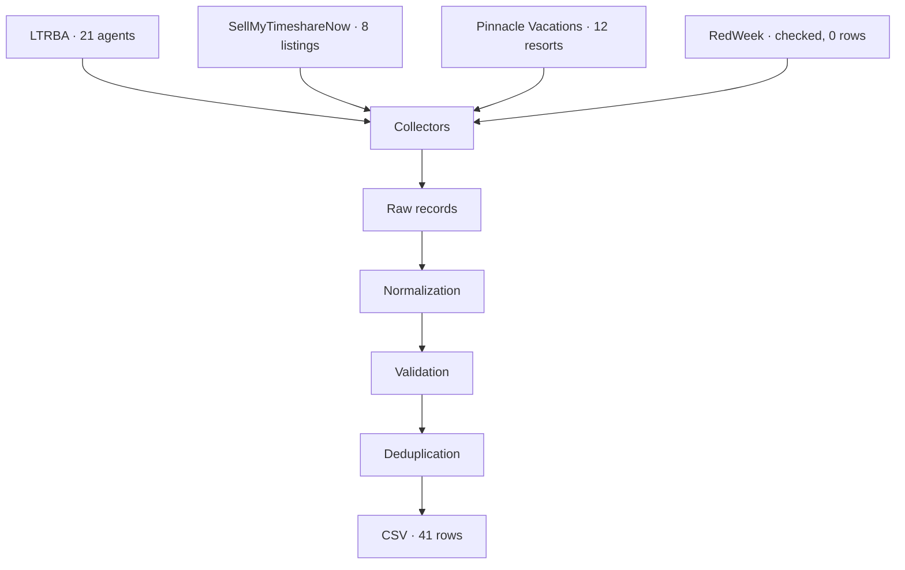

# Timeshare Data Collection Sample

## Overview

This repository is a small data-engineering sample. It collects publicly listed timeshare contacts and resorts, then runs them through a pipeline that normalizes, validates, deduplicates, and exports a traceable CSV.

The emphasis is data quality. The sample keeps about 40 records, every column filled, and records the page each row came from. It does not try to build a large owner database, and it does not bypass login, CAPTCHA, paywalls, or `robots.txt`.

## Dataset

`output/timeshare_owners.csv` is the only output. One row is one public contact as shown on one page, optionally tied to one resort.


| Column         | Meaning                                                                                                                 |
| -------------- | ----------------------------------------------------------------------------------------------------------------------- |
| `name`         | Person or business name printed on the page.                                                                            |
| `phone_number` | Normalized phone. Empty when the page has no unambiguous number.                                                        |
| `address`      | Contact address printed on the page. Not a resort street unless the page presents that street as the contact's address. |
| `resort`       | Resort name on a listing. Empty when the page does not name one resort.                                                 |
| `source`       | Site the row was collected from.                                                                                        |
| `source_url`   | Public URL where the row can be checked.                                                                                |
| `collected_at` | UTC timestamp when that page was parsed (`2026-10-02T17:43:28Z`).                                                       |
| `contact_type` | `owner`, `agent`, `company`, or `unknown`.                                                                              |


A current run has 41 rows, and every column is filled: 21 licensed brokers from LTRBA, 12 Pinnacle Vacations resorts, and 8 SellMyTimeshareNow listings. RedWeek was checked and contributed no rows, because the public page does not show a listing phone. Four LTRBA cards were left out because the page did not name both a resort and a place.

## Data Sources

Only pages that are reachable without an account were used.

- **LTRBA** ([member directory](https://www.licensedtimeshareresalebrokers.org/members-all)). Public cards for licensed timeshare resale brokers. Each card has a name and a phone. The row points at that member's public profile.
- **SellMyTimeshareNow** ([timeshares for sale](https://www.sellmytimesharenow.com/timeshares-for-sale/)). Public listing detail pages. The resort is on the page. The call-now number is the marketplace's, not a named owner's.
- **Pinnacle Vacations** ([search by state](https://www.pinnaclevacations.com/state-search.aspx)). Public resale results for a few states. The resort changes per listing. The phone and street address are the brokerage office in the page footer.
- **RedWeek** ([example public company page](https://www.redweek.com/timeshare-companies/hgvc)). Included so the gap is explicit. Direct owner contact for a resale sits behind membership. No owner fields were inferred.

`robots.txt` is fetched first. SellMyTimeshareNow asks for a 2 second crawl delay; the client waits at least that long between requests. Paths disallowed by `robots.txt` are not requested.

## Methodology

1. **Source discovery.** Open the public listing and directory pages. Note which of name, phone, address, and resort are actually in the HTML.
2. **Data collection.** A polite HTTP client fetches only allowed URLs, with a delay, a fixed user agent, and retries for transient failures.
3. **Parsing.** Each site has its own parser. Site chrome (header and footer phones) is not copied onto a listing unless that block is the contact the page shows for the listing.
4. **Normalization.** Phones become E.164, shouted resort names are title-cased, and address punctuation is cleaned. Values that are not really names or phones are cleared.
5. **Validation.** Rows without a source URL, with a bad contact type, or with no name, phone, and resort are dropped.
6. **Deduplication.** The same phone, name, and resort collapse to one row. A different resort, or a different person on a shared office line, stays.
7. **Export.** Sorted UTF-8 CSV at `output/timeshare_owners.csv`.



Field rules, the RedWeek decision, and why [Scrapit](https://github.com/joaobenedetmachado/scrapit) is not a dependency are written up in [docs/methodology.md](docs/methodology.md).

## Data Quality

- **Phone numbers.** NANP numbers are stored as `+1` and ten digits. International numbers keep their country code. A UK trunk `0` after `+44` is removed. Extensions stay (`+19704531226 x4`). A second number joined with "or" is not merged into the field; only the first unambiguous number is kept. A fragment that is not a full number becomes empty.
- **Addresses.** Whitespace and bullet separators are normalized. State abbreviations before a ZIP code are uppercased. Nothing is geocoded. For a broker, the address is the place named on the card, or the office street on the company site linked from that card. For a listing, it is the resort address printed on the detail page.
- **Duplicate detection.** Key: phone (extension ignored) + name + resort. The richer row wins. Twelve Pinnacle rows share one office phone because they are twelve resorts, not twelve copies of one listing.
- **Missing values.** Empty means "not on the page." It does not mean "looked up elsewhere" or "probably."
- **Contact classification.** LTRBA cards are `agent` because the directory is licensed brokers, not confirmed timeshare owners. Marketplace and brokerage lines are `company`. `owner` is unused: a "for sale by owner" badge does not identify the person or publish their phone. `unknown` is reserved for a phone whose owner cannot be classified; that case did not occur in this run.
- **Traceability.** Every row has the public URL it came from. LTRBA rows link to the member profile. SellMyTimeshareNow rows link to the ad. Pinnacle rows link to the state results page that listed that resort.


## How to Run

Python 3.11 or newer.

```bash
python -m venv .venv
```

Windows:

```bash
.venv\Scripts\activate
pip install -r requirements.txt
python -m src.main
```

macOS or Linux:

```bash
source .venv/bin/activate
pip install -r requirements.txt
python -m src.main
```

Optional settings live in `.env.example` (`REQUEST_DELAY_SECONDS`, listing caps, output path). Copy that file to `.env` to override the defaults. The defaults already respect a 2 second delay.

Check the transformation rules without hitting the network:

```bash
python -m unittest tests.test_quality -v
```

Re-running `python -m src.main` fetches the pages again and rewrites the CSV. `collected_at` changes. Upstream listings change too, so the file is a sample from the time it was generated, not a frozen census.

## Output

Forty-one rows from the run on 2 October 2026. Five of them:


| name               | phone_number    | address                                                       | resort                                                                                          | contact_type |
| ------------------ | --------------- | ------------------------------------------------------------- | ----------------------------------------------------------------------------------------------- | ------------ |
| Lisa Roach         | +14076709502    | Orlando, FL                                                   | Marriott Vacation Club; Breckenridge Grand Vacations; Westin; Sheraton; Hyatt; Hilton Resorts   | agent        |
| Jessica ODaniel    | +14053749255    | 29662 Johnson Road, Maud, OK 74854                            | Marriott Points; Breckenridge Grand Vacations Resorts; Starwood; Vistana; Westin; Hyatt; Hilton | agent        |
| Jan Nichols        | +19704531226 x4 | Breckenridge, Colorado                                        | Breckenridge                                                                                    | agent        |
| Pinnacle Vacations | +18004855632    | 4600 Summerlin Road, Suite C-2, Box 277, Fort Myers, FL 33919 | Hanalei Bay Resort                                                                              | company      |
| SellMyTimeshareNow | +18552993829    | 80 East Harmon Avenue, Las Vegas, Nevada                      | Elara, a Hilton Grand Vacations Club                                                            | company      |


Lisa Roach's source URL is `https://www.licensedtimeshareresalebrokers.org/SiteMembers/d6a91c07-f9b2-4b17-9e60-463e6d90aa40`. The Elara listing is `https://www.sellmytimesharenow.com/timeshares/index/content/details/AdNumber/100254121/sale/`. The full file has a `source_url` on every row.

## Limitations

- Collection stops at public pages. Login walls, CAPTCHAs, and disallowed paths are skipped.
- Many listings never print the owner's name, phone, or home address. Those cells stay empty, or the row is not created.
- LTRBA profiles identify brokers. They are classified as `agent`, even when the biography talks about helping owners.
- SellMyTimeshareNow and Pinnacle publish the company line, so those rows are `company`. The same office phone appears on more than one resort on purpose.
- A directory card sometimes prints two numbers or only a text line. The pipeline keeps one parseable number and does not recover a number that is not in the text.
- No missing value is inferred, searched, or filled from memory.
- The CSV is a point-in-time sample. Listing inventory moves.


## Possible Improvements

In a production setting this shape extends without changing the quality rules:

- more public sources, each behind the same `Record` contract
- a scheduler and incremental runs that only refetch changed URLs
- a database instead of a single CSV, with the source URL kept on the row
- automated checks for sudden drops in field coverage, new duplicate rates, and parser breakage
- run metrics and alerting when a source starts returning login walls or empty pages
- incremental updates keyed by source URL, so a rerun edits changed rows instead of replacing the file blindly

